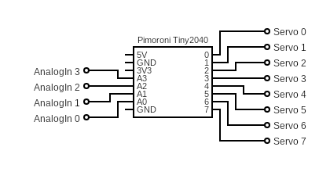
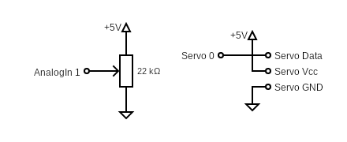

# multi_servo-thing #

a simple thing for the "[Modular-Things](https://github.com/modular-things/modular-things)" project that allows you to control up to 8 RC servos, 4 analog inputs and the built-in RGB LED


> Nota bene: in contrast to the "things" provided by the "Modular Things" project itself, this one has been developed for a [Pimoroni Tiny2040](https://shop.pimoroni.com/products/tiny-2040) board (which I had on my desk) and a [Waveshare RP2040-Zero](https://www.waveshare.com/wiki/RP2040-Zero) (which seems to be the cheapest of all small RP2040 boards). Since it uses the built-in RGB LEDs of that board, you may have to adjust the LED output commands in the Arduino "Firmware" shown below in order to make a thing for a different board.

> Strange: according to the [docs](https://files.waveshare.com/upload/5/58/RP2040-Zero.zip), the built-in WS2812 LED of a Waveshare RP2040-Zero should have a GRB byte order - however, I seem to have an official board (with logo and from a trusted seller) that uses an RGB order. My codes will still use the official GRB order, but some of the boards out there will thus show colors that differ from the expectation. However, this affects the built-in LED only, and everything else should work as expected. Which type of board you have can be easily recognized: just power it up (after uploading any "thing" firmware) and look at the LED: "normal" boards should glow green, others glow red.

## Wiring ##



When powered with 5V, servos may often be directly connected to the RP2040. However, if you plan to use higher voltages (e.g., 6V), you should insert a level shifter between RP2040 and servo.

> Servos should usually be powered by a separate power supply. If you still choose to power them via USB, you should stabilize the power supply of the servos with about 100µF per servo.

## Installation and Usage ##

Below are instructions for installation and use of the "multi_servo" thing - skip whatever does not seem applicable:

#### Firmware Preparation ####

1. Install Arduino IDE (see https://www.arduino.cc/en/software)
2. Install the board "**Raspberry Pi Pico/RP2040/RP2350** by Earle F. Philhower, III" using the Arduino "Boards Manager"
3. Install "**osap** by Jake Robert Read" using the Arduino "Library Manager"

#### Firmware Installation ####

1. Create a new sketch and rename it to `multi_servo`
2. Copy the firmware shown below (or the contents of file [multi_servo/firmware-RP2040-Zero/multi_servo/multi_servo.ino](multi_servo/firmware-RP2040-Zero/multi_servo/multi_servo.ino) if you have a Waveshare RP2040-Zero board) into the sketch editor using the clipboard
3. Connect the RP2040 board via USB and select it from the board dropdown in the Arduino IDE
4. Compile and upload the sketch

#### Software Preparation ####

1. Install Node.js (see https://nodejs.org/en/)
2. Download "modular-things" as a [ZIP archive](https://github.com/modular-things/modular-things/archive/refs/heads/main.zip), unpack it, and move it to a location of your choice
3. Open a terminal window and navigate to the extracted directory
4. run `npm install`

#### Software Installation ####

1. Open the terminal window and navigate to the extracted directory
2. copy the "multi_servo" directory from this repository and its contents into the `./things` folder. Delete the `firmware` folder for the wrong board and remove the board suffix from the name of the other (**you will not damage anything if you use the wrong firmware but the built-in LED will not work**). In the end, `./things/multi_servo` should have the following structure:
```
./things/multi_servo/
  circuit/
    images/
      layout.png
      schematic.png
      preview.png
  firmware/
    multi_servo/
      multi_servo.ino
  software/
    multi_servo.ts
```
3. Insert the following text into file `./things/_things.json` after the first line (i.e., after the opening bracket):
```json
  {
    "author":  "Andreas Rozek",
    "name":    "multi_servo",
    "software":"software/multi_servo.ts",
    "firmware":"firmware/multi_servo/multi_servo.ino",
    "images": [
      { 
        "name": "layout", 
        "src": "circuit/images/layout.png"
      },
      { 
        "name": "schematic", 
        "src": "circuit/images/schematic.png"
      },
      { 
        "name": "preview", 
        "src": "circuit/images/preview.png"
      }
    ]
  },
```
4. Insert the following lines into file `./index.ts`
  * `import multi_servo from "./multi_servo/software/multi_servo";`<br>
    e.g., as the last import statement
  * `multi_servo,`<br>
    e.g., as the last line in the `export default {` block
5. (Re)start the server<br>
    `npm run dev`

#### Thing Usage ####

1. Connect the properly prepared RP2040 board to your computer via USB.
2. Open the (**custom**) web environment: [http://localhost:3000](http://localhost:3000)
3. Click on "pair new thing" and select the "thing" you connected before<br>(the "List of Things" should now display a description of its interface).
4. Click on "rename" and change the name of your thing to "MultiServo" (this is the name used within the application example).
5. Copy the following example application into the web editor:<br>
```javascript
const BlinkDelay  = 800 // LED toggles every BlinkDelay milliseconds

let Timestamp = Date.now(), Value = 0
loop(async () => {
  let now = Date.now()
  if (Timestamp + BlinkDelay < now) {
    Value = (Value === 0 ? 0.1 : 0)
    await MultiServo.setRGB(0,0,Value)

    Timestamp = now
  }

  let AnalogIn = await MultiServo.getAnalog(1)
  MultiServo.setServo(0,AnalogIn*180)
}, 10)
```
6. Click on "run (shift + enter)"<br>(the LED on the RP2040 board should blink now).

## Firmware (Board-specific) ##

In the "Modular Things" terminology, the "firmware" of a thing is an Arduino sketch which implements a thing's functionality on the hardware side. Here is the one for a "multi_servo" thing based on a Pimoroni Tiny2040 (please, use the contents of file [multi_servo/firmware-RP2040-Zero/multi_servo/multi_servo.ino](multi_servo/firmware-RP2040-Zero/multi_servo/multi_servo.ino) for a Waveshare RP2040-Zero board instead):

```c++
#include <osap.h>
#include <Servo.h>

#define PIN_LED_R 18
#define PIN_LED_G 19
#define PIN_LED_B 20

  int AnalogIn[4]  = { 26,27,28,29 };
  int PIN_Servo[8] = { 0,1,2,3,4,5,6,7 };

  OSAP_Runtime osap;
  OSAP_Gateway_USBSerial serLink(&Serial);
  OSAP_Port_DeviceNames namePort("multi_servo");

/**** RGB Control (RGB LED on Tiny2040 is "active low"!) ****/

  void _setRGB (uint8_t* Data, size_t Length) {
    analogWrite(PIN_LED_R, 65535-(Length < 2 ? 0 : Data[0] + Data[1]*255));
    analogWrite(PIN_LED_G, 65535-(Length < 4 ? 0 : Data[2] + Data[3]*255));
    analogWrite(PIN_LED_B, 65535-(Length < 6 ? 0 : Data[4] + Data[5]*255));
  }
  OSAP_Port_Named setRGB("setRGB",_setRGB);

/**** Analog Input ****/

  size_t _getAnalog (uint8_t* Data, size_t Length, uint8_t* Response) {
    if (Length > 0) {
      int Port = Data[0];
      if ((Port >= 0) && (Port <= 3)) {
        uint16_t Value = analogRead(AnalogIn[Port]);
          Response[0] = Value & 0xFF;
          Response[1] = Value >> 8 & 0xFF;
        return 2;
      }
    }
    return 0;
  }
  OSAP_Port_Named getAnalog("getAnalog",_getAnalog);

/**** Servo Control ****/

  Servo ServoList[8];
  void _setServo (uint8_t* Data, size_t Length) {
    if (Length > 0) {
      int Port = Data[0];
      if ((Port >= 0) && (Port <= 7)) {
        ServoList[Port].write(Length == 1 ? 0 : (Data[1] > 180 ? 180 : Data[1]));
      }
    }
  }
  OSAP_Port_Named setServo("setServo",_setServo);

/**** Startup ****/

  void setup() {
    osap.begin();

    analogWriteResolution(16);             // according to RP2040 specifications
    analogReadResolution(12);                                            // dto.

    pinMode(PIN_LED_R,OUTPUT);
    pinMode(PIN_LED_G,OUTPUT);
    pinMode(PIN_LED_B,OUTPUT);

    analogWrite(PIN_LED_R,65535);              // initially switches the LED off
    analogWrite(PIN_LED_G,65535);                                        // dto.
    analogWrite(PIN_LED_B,65535);                                        // dto.

    for (int Port = 0; Port < 4; Port++) {
      analogRead(AnalogIn[Port]);
    }

    for (int Port = 0; Port < 8; Port++) {
      ServoList[Port].attach(PIN_Servo[Port],700,2700); // for SG90 micro servos
    }
  }

/**** Operation ****/

  void loop() {
    osap.loop();
  }
```

## Software ##

In the "Modular Things" terminology, the "software" of a thing is its JavaScript interface (which may still include some additional functionality on the software side). Here is the one for the "multi_servo" thing:

```typescript
import Thing from "../../../src/lib/thing"

export default class multi_servo extends Thing {
  async setRGB (R:number, G:number, B:number):Promise<void> {
    const LED_R = Math.floor(65535 * Math.max(0,Math.min(R,1)))
    const LED_G = Math.floor(65535 * Math.max(0,Math.min(G,1)))
    const LED_B = Math.floor(65535 * Math.max(0,Math.min(B,1)))

    const Datagram = new Uint8Array([
      LED_R & 0xFF, (LED_R >> 8) & 0xFF,
      LED_G & 0xFF, (LED_G >> 8) & 0xFF,
      LED_B & 0xFF, (LED_B >> 8) & 0xFF,
    ])
    await this.send('setRGB',Datagram)
  }

/**** Analog Input ****/

  async getAnalog (Port:number):Promise<number> {
    Port = Math.floor(Port)
    if ((Port < 0) || (Port > 3)) throw new Error(
      'multi-servo thing: invalid analog input port ' + Port
    )

    const Data = await this.send('getAnalog',new Uint8Array([Port]))
    return (Data[0] + Data[1]*255) / 4096
  }

/**** Servo Control ****/

  async setServo (Port:number, Angle:number):Promise<void> {
    Port = Math.floor(Port)
    if ((Port < 0) || (Port > 7)) throw new Error(
      'multi-servo thing: invalid servo port ' + Port
    )

    Angle = Math.floor(Math.max(0,Math.min(Angle,180)))
    await this.send('setServo',new Uint8Array([Port,Angle]))
  }

/**** API Specification ****/

  public api = [{
    name: 'setRGB',
    args: [
      'R: 0 to 1',
      'G: 0 to 1',
      'B: 0 to 1'
    ]
  },{
    name:  'getAnalog',
    args:  [ 'port: 0 to 3' ],
    return:'0 to 1'
  },{
    name: 'setServo',
    args: [ 'port: 0 to 7', 'angle: 0 to 180' ]
  }]
}
```

## Application Example ##

An "application" may be some JavaScript code entered into and run by the "Modular Things" web editor.

> **Important**: as soon as you plan to use custom things, you can no longer use the original web environment found at [https://modular-things.com/](https://modular-things.com/) but must navigate your browser to [http://localhost:3000](http://localhost:3000) (assuming that you use the default port).

Here is an example for an application using the "multi_servo" thing (actually a simple servo tester):

```javascript
const BlinkDelay  = 800 // LED toggles every BlinkDelay milliseconds

let Timestamp = Date.now(), Value = 0
loop(async () => {
  let now = Date.now()
  if (Timestamp + BlinkDelay < now) {
    Value = (Value === 0 ? 0.1 : 0)
    await MultiServo.setRGB(0,0,Value)

    Timestamp = now
  }

  let AnalogIn = await MultiServo.getAnalog(1)
  MultiServo.setServo(0,AnalogIn*180)
}, 10)
```



This application lets the built-in LED blink blue, and the potentiometer will control the position of the attached servo.

## License ##

[MIT License](LICENSE.md)
